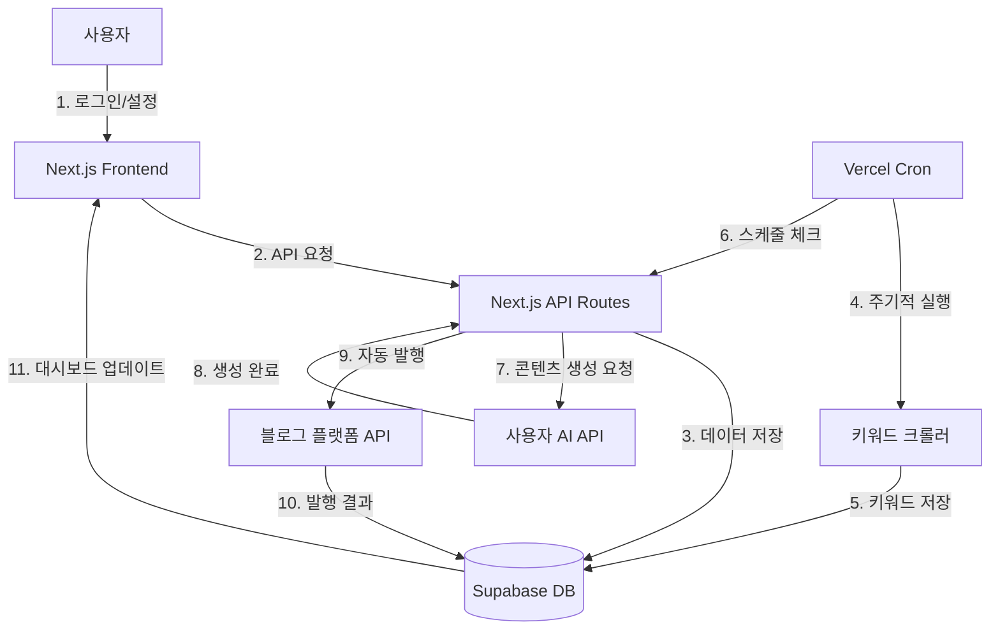

# 모라브(Morav) - TRD (기술 요구사항 정의서)

## 1. 시스템 아키텍처 (System Architecture)

```
┌─────────────────────────────────────────────────────────────┐
│                         사용자 (User)                        │
└────────────────────┬────────────────────────────────────────┘
                     │
                     ▼
┌─────────────────────────────────────────────────────────────┐
│              프론트엔드 (Next.js + Vercel)                   │
│  - 반응형 웹 (PC + 모바일)                                   │
│  - 대시보드, 설정, 결제 UI                                   │
└────────────────────┬────────────────────────────────────────┘
                     │
                     ▼
┌─────────────────────────────────────────────────────────────┐
│               백엔드 API (Next.js API Routes)                │
│  - 인증/인가 (JWT, OAuth)                                    │
│  - 비즈니스 로직 처리                                        │
│  - 스케줄러 트리거                                           │
└──────┬─────────┬─────────┬──────────┬──────────────────────┘
       │         │         │          │
       ▼         ▼         ▼          ▼
┌──────────┐ ┌────────┐ ┌─────────┐ ┌──────────────────────┐
│ Supabase │ │키워드  │ │사용자   │ │ 외부 서비스          │
│ (DB)     │ │크롤러  │ │AI API   │ │ - 토스페이먼츠       │
│          │ │(Cron)  │ │(BYOK)   │ │ - 티스토리 API       │
│          │ │        │ │         │ │ - 구글 블로그 API    │
│          │ │        │ │         │ │ - 워드프레스 API     │
└──────────┘ └────────┘ └─────────┘ └──────────────────────┘
```

**데이터 흐름:**
1. 사용자가 프론트엔드에서 카테고리/발행 시간 설정
2. 백엔드 API가 설정값을 DB에 저장
3. 키워드 크롤러가 주기적으로 인기 검색어 수집 → DB 저장
4. 스케줄러가 설정 시간에 맞춰 AI API 호출 → 콘텐츠 생성
5. 생성된 콘텐츠를 블로그 플랫폼 API로 자동 발행
6. 발행 결과를 DB에 기록, 사용자 대시보드에 표시

---

## 2. 권장 기술 스택 (Recommended Tech Stack)

### 프론트엔드 (Frontend)

**선택: Next.js 14+ (App Router)**

**선택 이유:**
- React 기반으로 AI 코딩 도구(Cursor, Claude)가 가장 잘 학습한 프레임워크
- SEO 최적화 (블로그 플랫폼이므로 검색 노출 중요)
- API Routes로 백엔드 로직을 함께 구현 가능 (풀스택)
- Vercel과 완벽 호환, 자동 배포 및 CDN 최적화

**대안:**
- Remix: 데이터 로딩 최적화, 하지만 Next.js보다 생태계 작음
- Vue.js (Nuxt): 러닝 커브 낮지만 AI 도구 지원 상대적으로 약함

**벤더 락인 리스크:**
- Vercel 의존도 높음 → 완화: Next.js는 Docker로 셀프 호스팅 가능

---

### 백엔드 (Backend)

**선택: Next.js API Routes + Supabase**

**선택 이유:**
- Next.js API Routes: 프론트엔드와 통합, 별도 서버 불필요
- Supabase: PostgreSQL 기반, 실시간 기능, Row Level Security 내장
- 서버리스 아키텍처로 소규모 시작 → 확장 용이

**대안:**
- Express.js + PostgreSQL: 더 많은 제어권, 하지만 인프라 관리 부담 증가
- Firebase: 빠른 개발, 하지만 복잡한 쿼리 제한적

**벤더 락인 리스크:**
- Supabase 의존 → 완화: PostgreSQL 표준 SQL 사용, 마이그레이션 가능

---

### 데이터베이스 (Database)

**선택: Supabase (PostgreSQL 기반)**

**선택 이유:**
- 관계형 데이터(사용자, 블로그, 발행 기록)에 적합
- Row Level Security로 사용자별 데이터 격리 자동화
- Realtime 기능으로 대시보드 업데이트 용이

**대안:**
- MongoDB: NoSQL 유연성, 하지만 복잡한 관계 쿼리 불리
- MySQL: 익숙함, 하지만 Supabase만큼 통합 기능 없음

**벤더 락인 리스크:**
- 낮음 (PostgreSQL 표준 사용)

---

### 배포/호스팅 (Deployment & Hosting)

**선택: Vercel (프론트엔드 + API) + Vercel Cron (스케줄러)**

**선택 이유:**
- Next.js와 네이티브 통합, 자동 배포 및 CDN
- Vercel Cron Jobs로 키워드 수집, 자동 발행 스케줄링
- 서버리스 함수로 소규모 시작 시 비용 효율적

**예상 비용 (월):**
- Vercel Pro: $20 (팀 사용, Cron 포함)
- Supabase Pro: $25 (8GB DB, 100GB 트래픽)
- **합계: 약 $45/월 (~₩60,000)**

**확장 전략:**
- 100명 이상: Vercel Enterprise 또는 AWS/GCP로 마이그레이션
- DB 부하 증가 시: Supabase 플랜 업그레이드 또는 Read Replica 추가

**대안:**
- AWS (EC2 + RDS): 더 많은 제어, 하지만 DevOps 부담 증가
- Netlify: Vercel과 유사, 하지만 Cron 기능 제한적

**벤더 락인 리스크:**
- 중간 (Vercel Cron 의존) → 완화: AWS Lambda + EventBridge로 마이그레이션 가능

---

### 외부 API/서비스 (External Services)

**필수 연동:**
1. **결제**: 토스페이먼츠 (1순위) / 스트라이프 (대체)
   - 이유: 한국 시장은 토스 친숙도 높음, 글로벌 확장 시 스트라이프
2. **블로그 플랫폼**:
   - 티스토리 API
   - 구글 블로거 API
   - 워드프레스 REST API
3. **AI API** (사용자 BYOK):
   - OpenAI, Claude, Gemini, Grok

**대체 옵션:**
- 결제: 이니시스, NHN KCP (하지만 개발 복잡도 높음)
- 블로그: 네이버 블로그 (향후 확장)

---

## 3. 비기능적 요구사항 (Non-Functional Requirements)

### 성능 (Performance)
- 대시보드 초기 로딩: 2초 이내
- AI 콘텐츠 생성: 30초 이내 (AI API 응답 시간 제외)
- 다중 발행 (3개 블로그): 5분 이내 완료
- 키워드 DB 조회: 0.5초 이내

### 보안 (Security)
- **API 키 암호화**: AES-256 암호화 후 DB 저장
- **HTTPS 강제**: 모든 통신은 TLS 1.3 이상
- **인증**: JWT 토큰 (액세스 15분, 리프레시 7일)
- **Rate Limiting**: IP당 분당 60 요청 제한
- **OWASP Top 10 대응**: SQL Injection, XSS 방지

### 확장성 (Scalability)
- 초기: 동시 사용자 50명 지원
- 6개월: 500명까지 확장 가능하도록 설계
- DB: 인덱싱 최적화, 쿼리 캐싱
- API: Serverless로 자동 스케일링

### 가용성 (Availability)
- 목표 Uptime: 99.5% (월 3.6시간 다운타임 허용)
- 모니터링: Vercel Analytics + Sentry (에러 추적)
- 백업: Supabase 자동 백업 (일 1회)

---

## 4. 데이터베이스 요구사항

### 스키마 설계 원칙
- 정규화 3NF까지 적용 (중복 최소화)
- 사용자별 데이터 격리 (Row Level Security)
- 인덱싱: 자주 조회되는 컬럼(user_id, blog_id, keyword, created_at)

### 인덱싱 전략
```sql
-- 사용자 조회 최적화
CREATE INDEX idx_users_email ON users(email);

-- 발행 기록 조회 최적화
CREATE INDEX idx_posts_user_blog ON posts(user_id, blog_id, created_at DESC);

-- 키워드 검색 최적화
CREATE INDEX idx_keywords_category ON keywords(category, trending_at DESC);
```

### 데이터 생명주기
- **개인정보 최소 수집**: 이메일, 결제 정보만 수집
- **보존 기간**: 
  - 사용자 계정: 탈퇴 후 30일 후 삭제
  - 발행 기록: 최근 6개월만 유지, 이후 익명화
  - 키워드 DB: 최근 30일 데이터만 유지
- **삭제/익명화 경로**: 
  - 사용자 탈퇴 시: 연관 데이터 CASCADE 삭제
  - GDPR 준수: "내 데이터 삭제" 기능 제공

---

## 5. 접근 제어 및 권한 모델

### 역할 정의 (Roles)
1. **일반 사용자 (User)**: 본인 계정, 블로그, 발행 기록만 접근
2. **관리자 (Admin)**: 모든 사용자 데이터 조회, 시스템 설정 변경
3. **지원팀 (Support)**: 사용자 문의 대응, 읽기 전용

### 권한 정책 (Permissions)
- **Supabase Row Level Security (RLS)** 사용
```sql
-- 사용자는 본인 데이터만 접근
CREATE POLICY user_own_data ON posts
FOR ALL USING (auth.uid() = user_id);

-- 관리자는 모든 데이터 접근
CREATE POLICY admin_all_access ON posts
FOR ALL USING (
  auth.jwt() ->> 'role' = 'admin'
);
```

---

## 6. 키워드 수집 아키텍처

### 수집 전략
- **소스**: 네이버 실시간 검색어, 구글 트렌드
- **빈도**: 1시간마다 Vercel Cron으로 실행
- **저장**: 키워드, 카테고리, 트렌드 점수, 수집 시각

### 최적화
- 중복 제거: 같은 키워드는 1시간 내 1회만 저장
- 캐싱: Redis 또는 Supabase 내 메모리 캐시 활용 (향후)

---

## 7. 시스템 다이어그램 (참고용 Mermaid)


