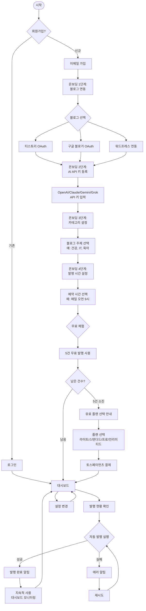

# 모라브(Morav) - User Flow (사용자 흐름도)

## 핵심 사용자 여정 (Primary User Journeys)



---

## 주요 흐름 설명

### FEAT-1: 회원가입 & 온보딩

**단계별 프로세스:**

1. **이메일 가입 또는 소셜 로그인**
   - 입력: 이메일, 비밀번호, 이름
   - 출력: 계정 생성, 이메일 인증 (선택)

2. **블로그 계정 연동 (OAuth)**
   - 사용자가 티스토리/구글 블로거/워드프레스 중 선택
   - OAuth 인증 플로우 진행
   - 블로그 URL 확인 및 저장

3. **AI API 키 등록 (암호화 저장)**
   - OpenAI/Claude/Gemini/Grok 중 선택
   - API 키 입력
   - 유효성 검증 (테스트 API 호출)
   - 암호화 후 DB 저장

4. **카테고리 설정 (키워드 필터링용)**
   - 블로그 주제 선택: 건강, IT, 육아, 여행, 음식, 패션 등
   - 다중 선택 가능
   - 선택한 카테고리만 인기 키워드 표시

5. **발행 시간 예약 설정**
   - 원하는 발행 시간 선택 (예: 매일 오전 9시)
   - 요일별 설정 가능 (월~일)
   - 타임존 자동 인식

---

### FEAT-2: 무료 체험

**프로세스:**

1. **5건 무료 발행 시작**
   - 온보딩 완료 즉시 발행 가능
   - 대시보드에 "무료 체험 중 (5건 남음)" 표시

2. **발행 진행 상황 표시**
   ```
   ✅ 발행 완료 1/5
   ✅ 발행 완료 2/5
   ✅ 발행 완료 3/5
   ⚠️ 발행 완료 4/5 (마지막 1건 남음!)
   🚫 무료 체험 종료
   ```

3. **5건 소진 시 유료 플랜 선택 화면**
   - 요금 테이블 표시
   - "계속 사용하려면 플랜을 선택하세요" CTA
   - 대시보드 읽기 전용 모드 (발행 기능 비활성화)

---

### FEAT-3: 자동 발행 루프

**자동화 프로세스:**

1. **설정된 시간에 스케줄러 실행**
   - Vercel Cron이 매시간 체크
   - `scheduled_at`이 현재 시각보다 이전인 posts 조회

2. **카테고리별 인기 키워드 조회**
   - 사용자가 설정한 카테고리 필터 적용
   - 트렌드 점수 높은 순으로 정렬
   - 상위 1개 키워드 선택

3. **사용자 AI API로 콘텐츠 생성**
   - 암호화된 API 키 복호화
   - AI API 호출 (텍스트 + 이미지)
   - 생성된 콘텐츠를 `posts` 테이블에 저장

4. **연동된 블로그에 자동 발행**
   - 티스토리/구글 블로거/워드프레스 API 호출
   - 발행 성공 시 `status = 'published'` 업데이트
   - 발행 시각 기록 (`published_at`)

5. **결과를 대시보드에 표시**
   - Supabase Realtime으로 실시간 업데이트
   - 성공: "✅ [블로그명]에 발행 완료"
   - 실패: "❌ 발행 실패 - 재시도 중"

6. **실패 시 재시도 (최대 3회)**
   - 1차 실패: 5분 후 재시도
   - 2차 실패: 15분 후 재시도
   - 3차 실패: `status = 'failed'` 처리, 사용자 알림

---

## 주요 시나리오

### 성공 시나리오 (Happy Path)

**사용자 "민수"의 여정:**

1. **회원가입** (2분)
   - 이메일 가입 → 이메일 인증

2. **온보딩** (5분)
   - 티스토리 2개, 워드프레스 1개 연동
   - OpenAI API 키 등록
   - 카테고리: "IT", "건강" 선택
   - 발행 시간: 매일 오전 9시

3. **무료 체험** (3일)
   - 1일차: 3건 발행 → 트래픽 확인
   - 2일차: 2건 발행 → 효과 체감
   - 3일차: "스탠다드 플랜 (월 200건)" 선택 → 결제

4. **지속 사용** (1개월+)
   - 매일 자동 발행 확인 (모바일 대시보드)
   - 주 1회 키워드 카테고리 조정
   - 월말: 트래픽 +60% 증가 확인

---

### 실패 시나리오 (Error Handling)

**시나리오 1: API 키 오류**
- **발생**: 잘못된 API 키 입력
- **처리**: 
  - "❌ API 키 검증 실패. 다시 확인해주세요" 에러 메시지
  - 재입력 유도
  - [OpenAI 키 발급 가이드] 링크 제공

**시나리오 2: 블로그 연동 실패**
- **발생**: OAuth 인증 거부 또는 토큰 만료
- **처리**:
  - "❌ 블로그 연동 실패. 다시 시도해주세요"
  - [티스토리 연동 가이드] 제공
  - 고객 지원 채팅 버튼 표시

**시나리오 3: 발행 실패 (플랫폼 에러)**
- **발생**: 티스토리 API 다운, rate limit 초과
- **처리**:
  - 자동 재시도 (최대 3회)
  - 실패 시 사용자 알림: "⚠️ [블로그명] 발행 실패 - 관리자에게 문의하세요"
  - 발행 건수 차감 안 함 (실패는 카운트 제외)

**시나리오 4: 결제 실패**
- **발생**: 카드 한도 초과, 결제 거부
- **처리**:
  - "❌ 결제 실패. 다른 결제 수단을 시도해주세요"
  - 다시 결제 페이지로 이동
  - 무료 체험 기간 1일 연장 (재결제 유도)

---

## 사용자 상호작용 포인트

### 대시보드 주요 위젯

1. **남은 발행 건수**
   - Progress Bar로 시각화
   - "200건 중 150건 사용 (75%)"

2. **최근 발행 목록 (10건)**
   - 제목, 블로그명, 발행 시각, 상태
   - 클릭 시 해당 블로그 게시물로 이동

3. **발행 성공률 차트**
   - 최근 7일간 성공/실패 비율
   - Recharts 라인 차트

4. **인기 키워드 미리보기**
   - 현재 트렌딩 중인 키워드 5개
   - 카테고리 필터 적용된 결과

5. **빠른 작업 버튼**
   - "지금 발행하기" (수동 트리거)
   - "설정 변경"
   - "플랜 업그레이드"

---

## 알림 및 피드백

### 실시간 알림 (Toast)

- **발행 완료**: "✅ [블로그명]에 발행 완료!"
- **발행 실패**: "❌ 발행 실패 - 재시도 중..."
- **무료 체험 종료**: "🚫 무료 체험이 종료되었습니다. 플랜을 선택해주세요."
- **결제 성공**: "💳 스탠다드 플랜 구독이 시작되었습니다!"

### 이메일 알림 (선택)

- 발행 요약 (주간): "이번 주 20건 발행 완료, 트래픽 +45% 증가"
- 플랜 만료 알림: "3일 후 구독이 만료됩니다"
- 발행 실패 (3회 연속): "블로그 연동을 다시 확인해주세요"

---

## 설정 변경 플로우

**사용자가 변경 가능한 항목:**

1. **블로그 추가/제거**
   - 새 블로그 연동 (OAuth 재진행)
   - 기존 블로그 제거 (확인 팝업)

2. **AI API 키 변경**
   - 새 키 등록
   - 기존 키 삭제 (확인 팝업)

3. **카테고리 재설정**
   - 체크박스로 다시 선택
   - 변경 즉시 적용

4. **발행 시간 조정**
   - 시간대 변경
   - 요일별 on/off 토글

5. **플랜 변경**
   - 업그레이드: 즉시 적용
   - 다운그레이드: 다음 결제일부터 적용
