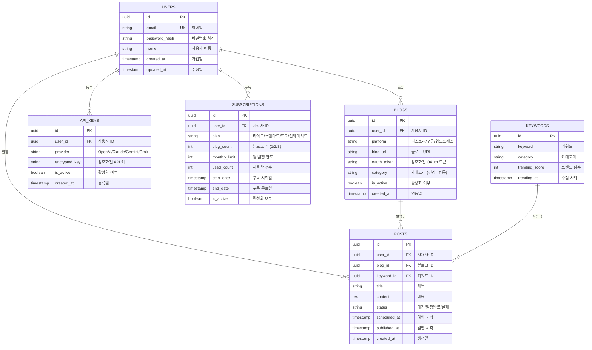

# 모라브(Morav) - Database Design (데이터베이스 설계)

## ERD (Entity Relationship Diagram)



---

## 테이블 상세 정의

### 1. USERS (사용자)

**목적**: 회원 정보 저장

**컬럼:**
| 컬럼명 | 타입 | 제약 | 설명 |
|--------|------|------|------|
| id | UUID | PK, NOT NULL | 사용자 고유 ID |
| email | VARCHAR(255) | UNIQUE, NOT NULL | 이메일 (로그인용) |
| password_hash | VARCHAR(255) | NOT NULL | 비밀번호 해시 (bcrypt) |
| name | VARCHAR(100) | NOT NULL | 사용자 이름 |
| created_at | TIMESTAMP | DEFAULT NOW() | 가입일 |
| updated_at | TIMESTAMP | DEFAULT NOW() | 수정일 |

**인덱스:**
```sql
CREATE INDEX idx_users_email ON users(email);
```

**Row Level Security (RLS):**
```sql
-- 사용자는 본인 데이터만 조회/수정 가능
CREATE POLICY user_self_access ON users
FOR ALL USING (auth.uid() = id);
```

---

### 2. BLOGS (블로그 연동)

**목적**: 사용자가 연동한 블로그 정보 저장

**컬럼:**
| 컬럼명 | 타입 | 제약 | 설명 |
|--------|------|------|------|
| id | UUID | PK, NOT NULL | 블로그 고유 ID |
| user_id | UUID | FK (users.id), NOT NULL | 소유자 ID |
| platform | VARCHAR(50) | NOT NULL | 'tistory', 'google', 'wordpress' |
| blog_url | VARCHAR(255) | NOT NULL | 블로그 URL |
| oauth_token | TEXT | NOT NULL | 암호화된 OAuth 토큰 |
| category | JSONB | NULL | 선택한 카테고리 배열 (예: ["건강", "IT"]) |
| is_active | BOOLEAN | DEFAULT TRUE | 활성화 여부 |
| created_at | TIMESTAMP | DEFAULT NOW() | 연동일 |

**인덱스:**
```sql
CREATE INDEX idx_blogs_user_id ON blogs(user_id);
CREATE INDEX idx_blogs_platform ON blogs(platform);
```

**RLS:**
```sql
-- 사용자는 본인 블로그만 접근
CREATE POLICY user_blogs_access ON blogs
FOR ALL USING (auth.uid() = user_id);
```

**제약 조건:**
```sql
-- platform은 3개 값만 허용
ALTER TABLE blogs
ADD CONSTRAINT check_platform
CHECK (platform IN ('tistory', 'google', 'wordpress'));
```

---

### 3. API_KEYS (AI API 키)

**목적**: 사용자가 등록한 AI API 키 저장 (BYOK)

**컬럼:**
| 컬럼명 | 타입 | 제약 | 설명 |
|--------|------|------|------|
| id | UUID | PK, NOT NULL | API 키 고유 ID |
| user_id | UUID | FK (users.id), NOT NULL | 소유자 ID |
| provider | VARCHAR(50) | NOT NULL | 'openai', 'claude', 'gemini', 'grok' |
| encrypted_key | TEXT | NOT NULL | AES-256 암호화된 API 키 |
| is_active | BOOLEAN | DEFAULT TRUE | 활성화 여부 |
| created_at | TIMESTAMP | DEFAULT NOW() | 등록일 |

**인덱스:**
```sql
CREATE INDEX idx_api_keys_user_id ON api_keys(user_id);
```

**RLS:**
```sql
-- 사용자는 본인 API 키만 접근
CREATE POLICY user_api_keys_access ON api_keys
FOR ALL USING (auth.uid() = user_id);
```

**제약 조건:**
```sql
-- 사용자당 provider별 키는 1개만 (중복 방지)
CREATE UNIQUE INDEX idx_api_keys_user_provider 
ON api_keys(user_id, provider) WHERE is_active = TRUE;
```

---

### 4. KEYWORDS (인기 키워드)

**목적**: 크롤링한 인기 검색어 저장

**컬럼:**
| 컬럼명 | 타입 | 제약 | 설명 |
|--------|------|------|------|
| id | UUID | PK, NOT NULL | 키워드 고유 ID |
| keyword | VARCHAR(200) | NOT NULL | 키워드 텍스트 |
| category | VARCHAR(50) | NOT NULL | 카테고리 ('건강', 'IT' 등) |
| trending_score | INT | DEFAULT 0 | 트렌드 점수 (높을수록 인기) |
| trending_at | TIMESTAMP | DEFAULT NOW() | 수집 시각 |

**인덱스:**
```sql
CREATE INDEX idx_keywords_category ON keywords(category, trending_at DESC);
CREATE INDEX idx_keywords_trending_at ON keywords(trending_at DESC);
```

**제약 조건:**
```sql
-- 같은 키워드는 1시간 내 1회만 저장 (중복 방지)
CREATE UNIQUE INDEX idx_keywords_unique 
ON keywords(keyword, DATE_TRUNC('hour', trending_at));
```

**자동 삭제 (Cron):**
```sql
-- 30일 지난 키워드 자동 삭제
DELETE FROM keywords
WHERE trending_at < NOW() - INTERVAL '30 days';
```

---

### 5. POSTS (발행 기록)

**목적**: 생성된 콘텐츠 및 발행 상태 추적

**컬럼:**
| 컬럼명 | 타입 | 제약 | 설명 |
|--------|------|------|------|
| id | UUID | PK, NOT NULL | 게시물 고유 ID |
| user_id | UUID | FK (users.id), NOT NULL | 작성자 ID |
| blog_id | UUID | FK (blogs.id), NOT NULL | 발행 블로그 ID |
| keyword_id | UUID | FK (keywords.id), NULL | 사용한 키워드 ID |
| title | VARCHAR(255) | NOT NULL | 제목 |
| content | TEXT | NOT NULL | 본문 |
| image_url | VARCHAR(500) | NULL | AI 생성 이미지 URL |
| status | VARCHAR(50) | DEFAULT 'scheduled' | 'scheduled', 'published', 'failed' |
| scheduled_at | TIMESTAMP | NOT NULL | 예약 시각 |
| published_at | TIMESTAMP | NULL | 실제 발행 시각 |
| error_message | TEXT | NULL | 실패 시 에러 메시지 |
| retry_count | INT | DEFAULT 0 | 재시도 횟수 |
| created_at | TIMESTAMP | DEFAULT NOW() | 생성일 |

**인덱스:**
```sql
CREATE INDEX idx_posts_user_blog ON posts(user_id, blog_id, created_at DESC);
CREATE INDEX idx_posts_status_scheduled ON posts(status, scheduled_at);
CREATE INDEX idx_posts_user_status ON posts(user_id, status);
```

**RLS:**
```sql
-- 사용자는 본인 게시물만 접근
CREATE POLICY user_posts_access ON posts
FOR ALL USING (auth.uid() = user_id);
```

**제약 조건:**
```sql
-- status는 3개 값만 허용
ALTER TABLE posts
ADD CONSTRAINT check_status
CHECK (status IN ('scheduled', 'published', 'failed'));
```

---

### 6. SUBSCRIPTIONS (구독 정보)

**목적**: 사용자 구독 플랜 및 사용량 추적

**컬럼:**
| 컬럼명 | 타입 | 제약 | 설명 |
|--------|------|------|------|
| id | UUID | PK, NOT NULL | 구독 고유 ID |
| user_id | UUID | FK (users.id), NOT NULL | 구독자 ID |
| plan | VARCHAR(50) | NOT NULL | 'light', 'standard', 'pro', 'unlimited' |
| blog_count | INT | NOT NULL | 블로그 수 (1, 2, 3) |
| monthly_limit | INT | NOT NULL | 월 발행 한도 (50, 200, 500, -1=무제한) |
| used_count | INT | DEFAULT 0 | 현재 사용한 건수 |
| start_date | TIMESTAMP | DEFAULT NOW() | 구독 시작일 |
| end_date | TIMESTAMP | NOT NULL | 구독 종료일 |
| is_active | BOOLEAN | DEFAULT TRUE | 활성화 여부 |
| payment_id | VARCHAR(255) | NULL | 결제 ID (토스페이먼츠) |

**인덱스:**
```sql
CREATE INDEX idx_subscriptions_user_id ON subscriptions(user_id);
CREATE INDEX idx_subscriptions_active ON subscriptions(is_active, end_date);
```

**RLS:**
```sql
-- 사용자는 본인 구독 정보만 접근
CREATE POLICY user_subscriptions_access ON subscriptions
FOR SELECT USING (auth.uid() = user_id);

-- 구독 정보 수정은 관리자만
CREATE POLICY admin_subscriptions_update ON subscriptions
FOR UPDATE USING (auth.jwt() ->> 'role' = 'admin');
```

**제약 조건:**
```sql
-- plan은 4개 값만 허용
ALTER TABLE subscriptions
ADD CONSTRAINT check_plan
CHECK (plan IN ('light', 'standard', 'pro', 'unlimited'));

-- blog_count는 1~3만 허용
ALTER TABLE subscriptions
ADD CONSTRAINT check_blog_count
CHECK (blog_count BETWEEN 1 AND 3);
```

**자동 리셋 (Cron):**
```sql
-- 매월 1일 00시에 used_count 리셋
UPDATE subscriptions
SET used_count = 0
WHERE DATE_TRUNC('month', NOW()) > DATE_TRUNC('month', start_date);
```

---

## 외래 키 관계

```sql
-- BLOGS → USERS
ALTER TABLE blogs
ADD CONSTRAINT fk_blogs_user
FOREIGN KEY (user_id) REFERENCES users(id)
ON DELETE CASCADE;

-- API_KEYS → USERS
ALTER TABLE api_keys
ADD CONSTRAINT fk_api_keys_user
FOREIGN KEY (user_id) REFERENCES users(id)
ON DELETE CASCADE;

-- POSTS → USERS
ALTER TABLE posts
ADD CONSTRAINT fk_posts_user
FOREIGN KEY (user_id) REFERENCES users(id)
ON DELETE CASCADE;

-- POSTS → BLOGS
ALTER TABLE posts
ADD CONSTRAINT fk_posts_blog
FOREIGN KEY (blog_id) REFERENCES blogs(id)
ON DELETE CASCADE;

-- POSTS → KEYWORDS
ALTER TABLE posts
ADD CONSTRAINT fk_posts_keyword
FOREIGN KEY (keyword_id) REFERENCES keywords(id)
ON DELETE SET NULL;

-- SUBSCRIPTIONS → USERS
ALTER TABLE subscriptions
ADD CONSTRAINT fk_subscriptions_user
FOREIGN KEY (user_id) REFERENCES users(id)
ON DELETE CASCADE;
```

---

## 주요 쿼리 예시

### 사용자 대시보드 조회

```sql
-- 사용자 정보 + 구독 정보 + 최근 발행 목록
SELECT 
  u.name,
  s.plan,
  s.monthly_limit,
  s.used_count,
  (s.monthly_limit - s.used_count) AS remaining_count,
  COUNT(p.id) AS total_posts,
  COUNT(CASE WHEN p.status = 'published' THEN 1 END) AS published_count,
  COUNT(CASE WHEN p.status = 'failed' THEN 1 END) AS failed_count
FROM users u
LEFT JOIN subscriptions s ON u.id = s.user_id AND s.is_active = TRUE
LEFT JOIN posts p ON u.id = p.user_id AND p.created_at > NOW() - INTERVAL '7 days'
WHERE u.id = '...'
GROUP BY u.id, s.plan, s.monthly_limit, s.used_count;
```

### 예약 발행 대상 조회 (Cron)

```sql
-- 발행 시각 도래한 posts 조회
SELECT 
  p.*,
  b.platform,
  b.blog_url,
  b.oauth_token,
  ak.provider,
  ak.encrypted_key,
  k.keyword
FROM posts p
JOIN blogs b ON p.blog_id = b.id
JOIN api_keys ak ON p.user_id = ak.user_id AND ak.is_active = TRUE
LEFT JOIN keywords k ON p.keyword_id = k.id
WHERE p.status = 'scheduled'
  AND p.scheduled_at <= NOW()
  AND p.retry_count < 3
ORDER BY p.scheduled_at ASC
LIMIT 100;
```

### 카테고리별 인기 키워드 조회

```sql
-- 사용자가 선택한 카테고리의 최신 트렌드 키워드
SELECT keyword, trending_score, trending_at
FROM keywords
WHERE category = ANY(ARRAY['건강', 'IT']) -- 사용자 카테고리
  AND trending_at > NOW() - INTERVAL '24 hours'
ORDER BY trending_score DESC, trending_at DESC
LIMIT 10;
```

### 구독 한도 체크

```sql
-- 발행 전 사용량 확인
SELECT 
  CASE 
    WHEN monthly_limit = -1 THEN TRUE -- 무제한
    WHEN used_count < monthly_limit THEN TRUE
    ELSE FALSE
  END AS can_publish,
  (monthly_limit - used_count) AS remaining
FROM subscriptions
WHERE user_id = '...' AND is_active = TRUE;
```

---

## 데이터 백업 및 복구

### 백업 전략
- **Supabase 자동 백업**: 일 1회 전체 DB 백업 (Point-in-Time Recovery)
- **수동 백업**: 주 1회 CSV 내보내기 (중요 테이블)

### 복구 절차
1. Supabase Dashboard → Backups
2. 복구 시점 선택
3. "Restore" 클릭
4. 복구 완료 후 데이터 검증

---

## 성능 최적화

### 인덱스 전략
- **복합 인덱스**: (user_id, created_at DESC) → 사용자별 최신 데이터 조회 최적화
- **부분 인덱스**: is_active = TRUE인 레코드만 인덱싱 → 디스크 절약

### 쿼리 최적화
- **N+1 문제 방지**: JOIN 사용, eager loading
- **페이지네이션**: LIMIT/OFFSET 대신 Cursor-based Pagination (created_at 기준)
- **캐싱**: 인기 키워드는 Redis 캐시 (1시간 TTL)

### 파티셔닝 (향후)
- POSTS 테이블: created_at 기준 월별 파티셔닝 (데이터 증가 시)
